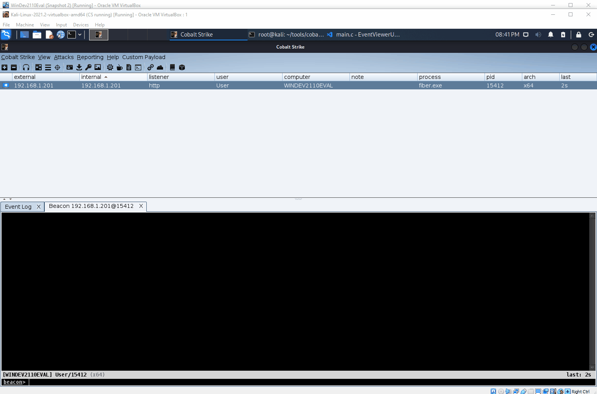

# EventViewerUAC_BOF
This is a Beacon Object File implementation of the Event Viewer deserialization UAC bypass discovered by [@orange_8361](https://twitter.com/orange_8361) and the POC put together by [CsEnox](https://github.com/CsEnox/EventViewer-UACBypass).



Tested on x64 Win10/Win11

## OPSEC WARNINGS!
This UAC bypass performs the following actions which should be considered in reference to OPSEC:

**-1.** Writes a binary file to %LOCALAPPDATA%\Microsoft\Event Viewer\RecentViews

**-2.** Calls ShellExecute() to start mmc.exe / Event Viewer

  **--A.** Event Viewer will open to GUI!
  
  **--B.** Event Viewer will call cmd.exe
  
   **---a.** Cmd.exe will call Taskkill in order to close mmc.exe
   
   **---b.** Cmd.exe will print an error message to the sometimes-held open console window in the interest of tricking the user to believe nothing is wrong
      
   **---c.** Cmd.exe will execute whatever other commands are supplied by the user
    
**-3.** The binary file is deleted from %LOCALAPPDATA%\Microsoft\Event Viewer\RecentViews


## How it works
Following the original demonstration and CsEnox's POC, [ysoserial](https://github.com/pwntester/ysoserial.net) was used to create an initial payload:


```
ysoserial.exe -o raw -f BinaryFormatter -g TextFormattingRunProperties -c "taskkill /f /im mmc.exe >nul && echo Windows has Recovered from an Unexpected Error.  You may Close this Window. &&" > cmd.bin
```

This UAC bypass works by invoking mmc.exe, which opens to the screen and must be closed. Unfortunately I have not found a way to start mmc.exe without the GUI opening; I have looked at CreateProcess() and the CREATE_NO_WINDOW flag, however CreateProcess() doesn't play nice with UAC.  StackOverflow posts on this topic directed me to the ShellExecuteA() api which does have the SW_HIDE flag (and others), but this did not prove fruitful.  Mmc.exe flashing to the screen seems unavoidable.

Ysoserial calls cmd.exe /c, so this is used to call taskkill in order to close mmc.exe. && is used to chain commands together so that the desired action to perform as an Administrator can be executed.  I found in testing that in some cases that action would hold the cmd.exe prompt spawned by mmc.exe open; this is the case when calling Local Injector(normal) payloads, like the default Cobalt Strike executable payload.  To address this, I sent the output from the taskkill command (which previously would print to the held-open cmd.exe) to /dev/null, and echo'd to the screen a message regarding an error that has been handled in order to try and make this suspicious behavior not alarm an uneducated user.

Payloads that spawn a process, inject into it, and then exit will not hold open the cmd.exe window, and thus the message is unnecessary.  Similarly, commands that execute and exit (e.g. net user Administrator newpassword) will not hold open the window.

You may execute powershell encoded commands via this BOF:


The taskkill command and message to the user are baked into the ysoserial command.  If you wanted to alter this behavior you would need to run your own ysoserial command and follow the demonstration below of how the code was created.

Using a custom tool, the binary file was ingested and printed as hex:


Copying this to notepad and searching for '\&amp;' in hex locates the desired bytes (note there are several sets of this, we need the last one):


The payload is split into two parts immediately after these bytes:


Each part's length is calculated and noted for later.

This is where things get hairy.

Truth be told I don't know much of anything about deserialization or ysoserial, but I discovered that there are a set of bytes in the payload that represent the length of the "important" part of the payload, to include the user defined command.  This can be seen in the following screenshot of a side-by-side hex dump of two different payloads created by ysoserial, each of which contained a different command to execute:
  


For reasons I can't explain, these bytes reflect the length of the payload in base-128; the 0x05 is multiplied by 128 to yield 640; this is added to the value of the other byte (0xb0 or 0xd4) minus 128; I found that when the second byte (0x05) rolls over (0x06), the first byte starts over at 0x80 as opposed to 0x00 as might be expected.

The payload used in this tool looks like this:


  
Converting all values to decimal, the math looks like this:

(6 x 128) + (180-128) = 820
  
The size of the file is 1042; I found in testing that there is (with this gadget from ysoserial anyways) always a 222 byte difference between the size of the file and the length reflected in this set of bytes.  These 222 bytes appear to be the "header of the payload.
  
Both parts of the payload are copied to main.c, where the original length of 820 is also set as a variable.  The length of the user command is calculated, and this value is added to the original 820 (in addition to a single extra byte for a space that must be inserted) in order to calculate the final value that needs to be represented in this set of bytes.  The second byte is calculated by dividing LenBytes by 128, and the first byte is calculated by finding the remainder of LenBytes and adding 128 (in order to accommodate how it starts at 0x80).
  

  
Once these bytes are set, they are copied into the Before buffer at the proper place in order to set the length of the payload to the proper value given the contents.  The final buffer is then assembled:


The finalized payload is then written to disk and mmc.exe called in order to execute it.  Afterwards the payload is cleaned up.
  
## To Compile:

```
x86_64-w64-mingw32-gcc -o EventViewerUAC.x64.o -Os -c main.c -DBOF
```

## Further Work

Ysoserial offers a --rawcmd option where you can invoke a different executable than cmd.exe, however you cannot provide any arguments to it.  This opens the door to being able to directly invoke your payload without calling cmd.exe and thus not leaving the console window open; however there would be nothing to close mmc.exe in this case.  One could write their payloads to determine the parent process of the payload and if it is mmc.exe, kill mmc.exe in order to clean up after this UAC bypass.  This is very possible, however I didn't go to the trouble to do so as this is one of many UAC bypasses out there, and not everyone is creating their own custom payloads like that.  I may incorporate into my personal runners.

## Credits

1. [@orange_8361](https://twitter.com/orange_8361) 
2. [CsEnox](https://github.com/CsEnox/EventViewer-UACBypass).
  
